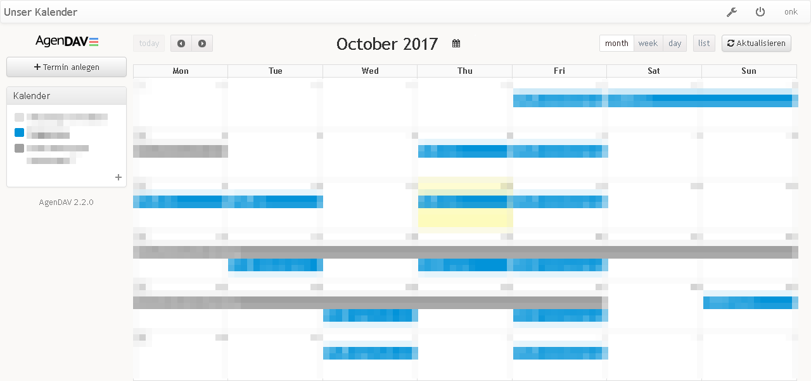

<!--
N.B.: This README was automatically generated by <https://github.com/YunoHost/apps/tree/master/tools/readme_generator>
It shall NOT be edited by hand.
-->

# AgenDAV for YunoHost

[](https://ci-apps.yunohost.org/ci/apps/agendav/)


[](https://install-app.yunohost.org/?app=agendav)

*[Read this README in other languages.](./ALL_README.md)*

> *This package allows you to install AgenDAV quickly and simply on a YunoHost server.*  
> *If you don't have YunoHost, please consult [the guide](https://yunohost.org/install) to learn how to install it.*

## Overview

AgenDAV is a CalDAV web client which features an AJAX interface to allow users to manage their own calendars and shared ones.


**Shipped version:** 2.6.0~ynh5

**Demo:** <https://demo.yunohost.org/agendav>

## Screenshots



## :red_circle: Antifeatures

- **Upstream not maintained**: This software is not maintained anymore. Expect it to break down over time, be exposed to unfixed security breaches, etc.

## Documentation and resources

- Official admin documentation: <https://agendav.readthedocs.io>
- Upstream app code repository: <https://github.com/agendav/agendav>
- YunoHost Store: <https://apps.yunohost.org/app/agendav>
- Report a bug: <https://github.com/YunoHost-Apps/agendav_ynh/issues>

## Developer info

Please send your pull request to the [`testing` branch](https://github.com/YunoHost-Apps/agendav_ynh/tree/testing).

To try the `testing` branch, please proceed like that:

```bash
sudo yunohost app install https://github.com/YunoHost-Apps/agendav_ynh/tree/testing --debug
or
sudo yunohost app upgrade agendav -u https://github.com/YunoHost-Apps/agendav_ynh/tree/testing --debug
```

**More info regarding app packaging:** <https://yunohost.org/packaging_apps>
